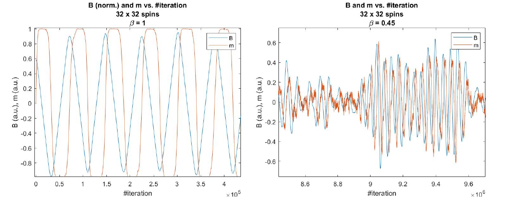

# ising-feedback-model
Implementation of a negative-feedback Ising model, with Monte Carlo sampling and time-series analysis used to investigate and replicate statistical and dynamical features of biological neural networks, namely the coexistence of oscillations (brain waves) and avalanches around the critical point transition - published in Nature Comp. Sci. 2023.

Note: these are only the codes related to mine (and only mine) contribution to the research that culiminated in the publication. The publication itself can be found [here](https://www.nature.com/articles/s43588-023-00410-9) and the official codebased for the publication [here](<https://github.com/demartid/stat_mod_ada_nn>)
